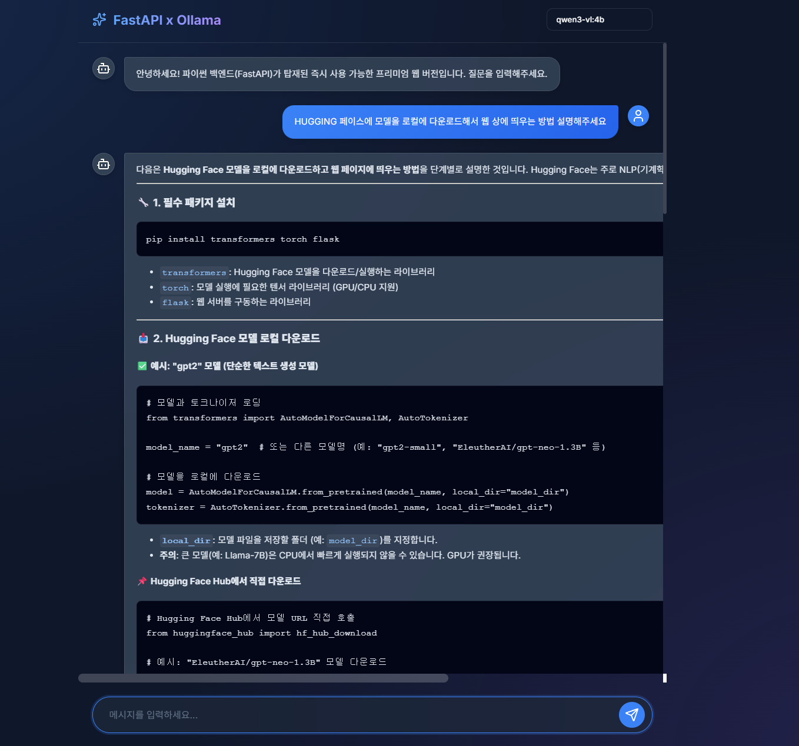

# ✨ Ollama FastAPI Chat

> **로컬 LLM(Ollama)** 위에 올라간, 외부 의존성 없는 풀스택 AI 채팅 웹앱.
> FastAPI 백엔드 하나가 API + 정적 UI를 동시에 서빙하므로 Node.js · 빌드 도구 · 외부 CDN 인증 같은 번거로움이 전혀 없습니다.



---

## 📌 프로젝트 개요

이 프로젝트는 로컬에서 실행 중인 **Ollama** LLM 엔진을 가장 간단한 방식으로 웹 UI에 연결한 예제입니다.

- **Backend (FastAPI)** : Ollama의 REST API(`/api/tags`, `/api/chat`)를 프록시하고, 스트리밍 응답을 그대로 클라이언트에 전달합니다.
- **Frontend (Vanilla HTML/CSS/JS)** : 별도 빌드 없이 `index.html` 한 파일로 구동되는 글래스모피즘 UI.
- **AI Engine (Ollama)** : 로컬 머신에서 LLM을 직접 실행 — 인터넷 차단 환경(학내망/사내망)에서도 동작.

> 학교/회사 방화벽, SSL 인터셉트, Hugging Face 차단 등으로 LLM 데모를 띄우기 어려운 환경에서 빠르게 데모를 보여주기 위해 만든 구조입니다.

---

## 🌟 주요 기능

| 기능 | 설명 |
|------|------|
| ⚡ **Zero-Setup Frontend** | Node.js · React · Webpack 불필요. FastAPI가 정적 HTML을 그대로 서빙 |
| 🎨 **Premium UI** | 글래스모피즘 + 다크모드 + 그라디언트 + Lucide Icons |
| 🔄 **실시간 스트리밍** | Ollama의 `stream=true` 응답을 NDJSON 그대로 패스스루, ChatGPT 스타일 타이핑 효과 |
| 📝 **마크다운 렌더링** | `marked.js`로 코드블록·리스트·강조까지 즉시 렌더 |
| 🧠 **모델 자동 탐지** | `/api/models`로 로컬에 설치된 Ollama 모델을 자동 로드해 셀렉트 박스에 표시 |
| 🛡 **네트워크 견고성** | 외부 모델 다운로드 없이 로컬 Ollama만 사용 — DPI 방화벽 환경에서도 안정 |
| 🌐 **CORS 허용** | `allow_origins=["*"]`로 어떤 도메인에서도 호출 가능 |

---

## 🛠 기술 스택

### Backend
- **Python 3.11+**
- **FastAPI** — 비동기 REST API 프레임워크
- **Uvicorn** — ASGI 서버
- **HTTPX** — Ollama 비동기 HTTP 클라이언트
- **Pydantic** — 요청 모델 검증

### Frontend
- **Vanilla JavaScript (ES6+)**
- **HTML5 / CSS3** (커스텀 변수, backdrop-filter, animation)
- **Lucide Icons** — SVG 아이콘
- **Marked.js** — 마크다운 → HTML 변환

### AI Engine
- **Ollama** — 로컬 LLM 런타임 (Llama3, Mistral, Gemma, Qwen 등 지원)

---

## 🚀 시작하기

### 1. 사전 준비

| 도구 | 설치 |
|------|------|
| Python 3.11+ | <https://www.python.org/downloads/> |
| Ollama | <https://ollama.com/> |
| Ollama 모델 1개 이상 | 예: `ollama pull llama3` 또는 `ollama pull qwen2:7b` |

Ollama가 정상적으로 떠 있는지 확인:
```bash
ollama list
curl http://localhost:11434/api/tags
```

### 2. 클론 & 의존성 설치

```bash
git clone https://github.com/parktaeyun0124/-llm.git
cd -llm

# (권장) 가상환경
python -m venv .venv
source .venv/bin/activate          # Windows: .venv\Scripts\activate

pip install -r requirements.txt
```

### 3. 서버 실행

```bash
python -m uvicorn main:app --host 0.0.0.0 --port 8000 --reload
```

브라우저에서 접속:
```
http://localhost:8000
```

상단 셀렉트 박스에서 모델을 고르고 메시지를 입력하면 됩니다.

---

## 🔌 API 명세

| Method | Path | 설명 | 응답 |
|--------|------|------|------|
| `GET`  | `/`           | 채팅 UI(`index.html`) 반환 | `text/html` |
| `GET`  | `/api/models` | 설치된 Ollama 모델 목록 | `application/json` (Ollama `/api/tags` 패스스루) |
| `POST` | `/api/chat`   | 스트리밍 채팅 응답 | `application/x-ndjson` (Ollama `/api/chat` 스트림 패스스루) |

### `POST /api/chat` 요청 예시
```json
{
  "model": "llama3",
  "messages": [
    { "role": "user", "content": "안녕! 자기소개 해줘." }
  ]
}
```

### 응답 예시 (NDJSON, 한 줄 = 한 청크)
```
{"model":"llama3","message":{"role":"assistant","content":"안"},"done":false}
{"model":"llama3","message":{"role":"assistant","content":"녕"},"done":false}
...
{"model":"llama3","message":{"role":"assistant","content":""},"done":true}
```

---

## 📁 프로젝트 구조

```
.
├── main.py            # FastAPI 진입점 — 라우팅 + Ollama 프록시 + 스트리밍
├── index.html         # 단일 파일 프론트엔드 (CSS·JS 인라인)
├── requirements.txt   # Python 의존성
├── preview.png        # 앱 스크린샷 (README용)
├── 이미지.png          # 원본 스크린샷
└── README.md
```

### main.py 핵심 흐름

```
브라우저 ──▶ FastAPI ──▶ Ollama (localhost:11434)
   ▲           │
   └── 스트림 응답 (NDJSON 청크 그대로 forward) ◀──┘
```

- `read_root()` : 루트 경로에서 `index.html` 반환
- `get_models()` : `httpx`로 Ollama `/api/tags` 호출
- `chat_stream()` : `httpx.AsyncClient.stream()` + `StreamingResponse`로 청크 단위 즉시 전달

---

## 🎨 UI 디자인 포인트

- **컬러 팔레트** : `#0f172a` 베이스 + `#3b82f6`(블루) / `#a78bfa`(퍼플) 그라디언트
- **글래스모피즘** : `backdrop-filter: blur(12px)` + 반투명 배경
- **마이크로 인터랙션** :
  - 메시지 등장 시 `fadeIn` 애니메이션
  - 응답 대기 중 dot bounce 인디케이터
  - 전송 버튼 hover 시 글로우 효과

---

## 🧪 빠른 테스트

서버를 띄운 뒤 별도 터미널에서:

```bash
# 모델 목록
curl http://localhost:8000/api/models

# 채팅 (스트리밍)
curl -N -X POST http://localhost:8000/api/chat \
  -H "Content-Type: application/json" \
  -d '{"model":"llama3","messages":[{"role":"user","content":"hello"}]}'
```

---

## 🐛 트러블슈팅

| 증상 | 원인 / 해결 |
|------|-------------|
| 셀렉트 박스에 "백엔드 연결 실패" | FastAPI(8000) 실행 여부 확인 |
| "Ollama 모델이 없습니다" | `ollama pull <모델명>`으로 모델 설치 |
| 응답이 깨지거나 비어 있음 | Ollama(11434) 실행 여부, `OLLAMA_BASE_URL` 확인 |
| 한글이 깨짐 | 브라우저/터미널 UTF-8 인코딩 확인 |
| CORS 에러 | `main.py`의 `allow_origins`에 도메인 추가 |

---

## 🗺 향후 개선 아이디어

- [ ] 채팅 히스토리 영속화 (SQLite / IndexedDB)
- [ ] 모델 파라미터(temperature, top_p) 조절 UI
- [ ] 멀티턴 대화 시스템 프롬프트 입력 영역
- [ ] 이미지/파일 첨부 → 멀티모달 모델(Llava 등) 연동
- [ ] Docker 이미지 배포

---

## 📝 라이선스

MIT License — 자유롭게 수정·배포 가능.
